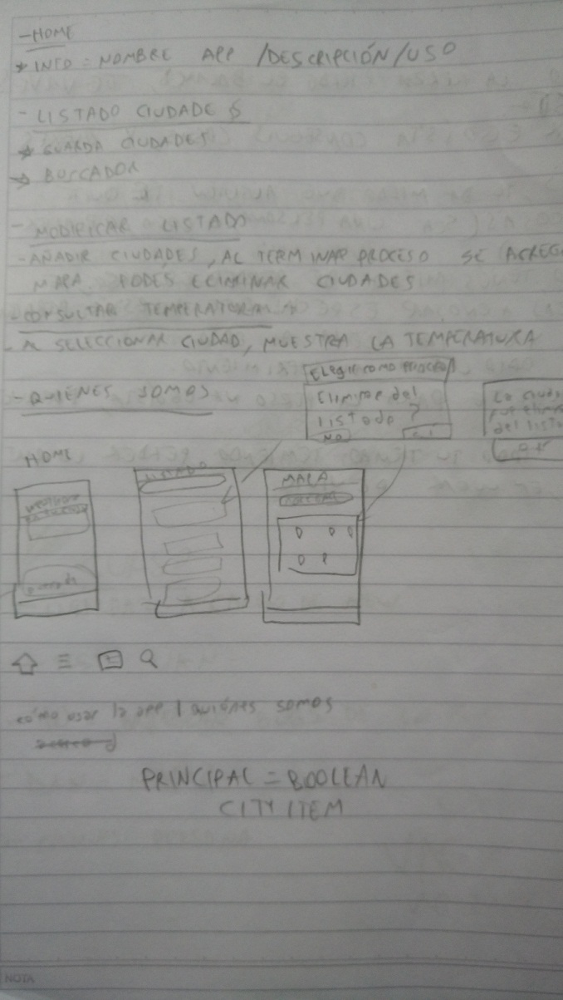
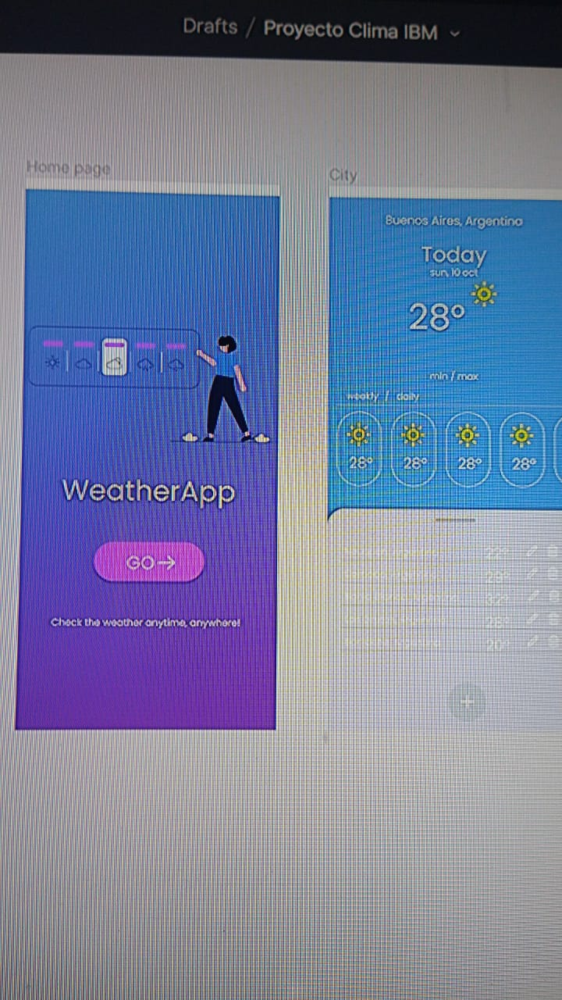
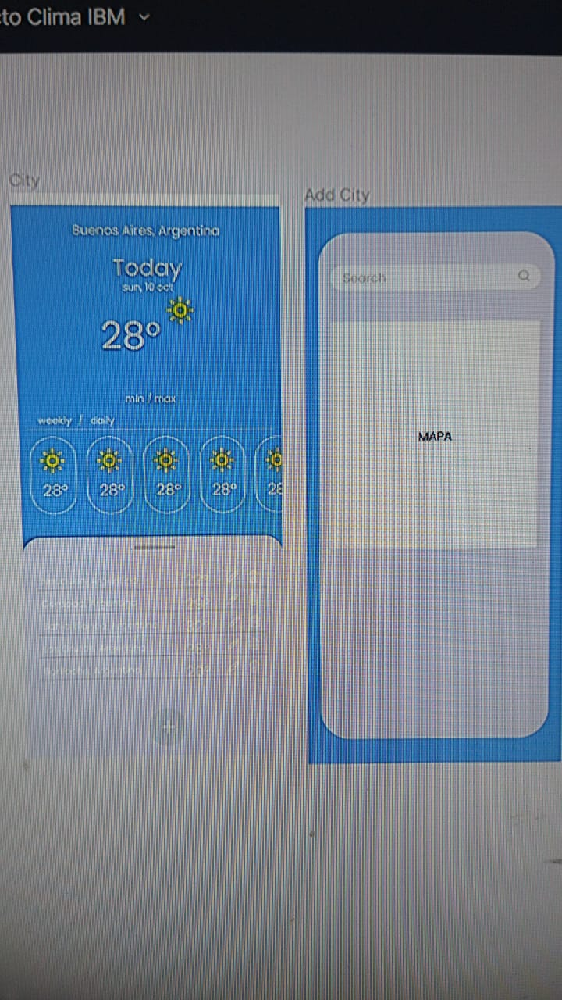
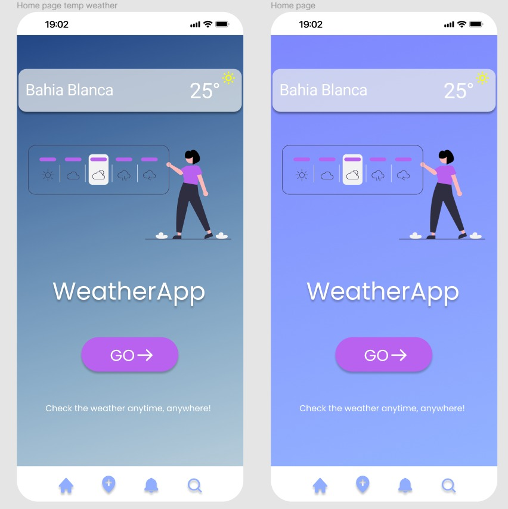
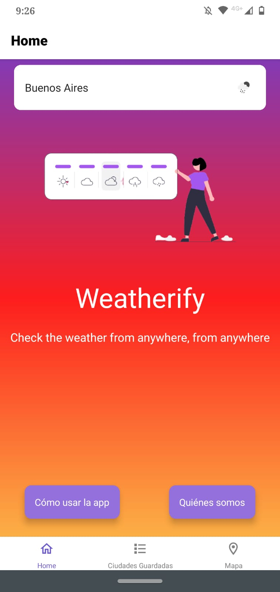

# Curso de especialización en desarrollo mobile - Codo a Codo | IBM Skillsbuild
## Proyecto grupal: aplicación para celular sobre el clima


[Ver en Snack](https://snack.expo.dev/@diestro/proyecto-ibm-final)

[Repositorio en GitHub](https://github.com/DiestroCorleone/proyecto-ibm-grupo-95/)

### Descripción:

En ese proyecto, generaremos una aplicación que consuma un servicio del clima y permita agregar
ciudades a un listado. Esta información deberá ser visualizada en un mapa. Cuando el usuario seleccione
una ciudad se deberá desplegar la temperatura del lugar.

## Tecnologías/conceptos usados:

1. __Lenguaje de programación y Toolkit:__ React Native
2. __Fuentes de datos:__ [API Weather](https://openweathermap.org/current)
3. __Persistencia de datos:__ SQL Lite (Android) o Core Data (iOS)
4. __Versionamiento de código:__ Git y Github
5. __Fetch:__ [Axios](https://www.npmjs.com/package/react-native-axios)

## Colaboradores:

* @Vaninaquezada
* @GayoneEmiliano
* @paganond
* @DiestroCorleone

## Detalles del Proyecto

## Paper Prototyping:



## Figma Prototyping:






## Persona Canvas:

[Descargar en PDF](misc/persona-canvas.pdf)

### Nombre de la app:

* Weatherify.

### Navegación:

* __BottomTabNavigator__ que lleva a las stacks de _Home_, _Lista de Ciudades_ y _Mapa_.

### Screens:

* __Home:__ Muestra el título de la aplicación, el clima de la ciudad elegida como principal, y tiene dos botones/links (_Cómo usar la app_ y _Quiénes somos_) que abren un modal para mostar dicha info.
* __Lista de ciudades:__ Presenta la lista de ciudades guardadas con su correspondiente clima. Cuenta con una barra de búsqueda para filtrar ciudades de la lista.
* __Mapa__: Cuenta con un mapa que muestra las ciudades guardadas, y un buscador para agregar más ciudades al listado. Cuenta con un buscador de ciudades. Al 23/10/2021 permite mostrar alerts de error de ingresarse una búsqueda vacía o menor a 3 caracteres, y mostrar nombre e ícono del clima de la ciudad buscada.

### Componentes:

* __ItemWeather:__ Importa ListItem, toma props como nombre de la ciudad e ícono, para reutilizar en diferentes screens.
* __Modal:__ Modales emergente, importan Overlay de React Native, reutilizables. Permiten agregar/eliminar a ciudades principales/guardadas.
* __Loading:__ Spinner que muestra pantalla de carga mientras se realizan diversos procesos.

### Funciones Principales:
* ```openDatabase()```: Se ejecuta en [App.js](https://github.com/DiestroCorleone/proyecto-ibm-grupo-95/blob/master/App.js), y desde allí es llamada desde cualquier parte de la app donde se necesite conexión a la base de datos.
* ```loadPrincipal()```: Presente en [Home.js](https://github.com/DiestroCorleone/proyecto-ibm-grupo-95/blob/master/app/screens/Home.js), cada vez que se enfoque dicha screen, traerá la ciudad elegida como prinicipal, de haber alguna.
* ```loadSavedCities()```: Se encuentra en la screen [CityList.js](https://github.com/DiestroCorleone/proyecto-ibm-grupo-95/blob/master/app/screens/CityList.js), y buscará las ciudades guardadas (de haberlas) cada vez que se enfoque la screen.
* ```consumeApi()```: Se halla en la screen [Map.js](https://github.com/DiestroCorleone/proyecto-ibm-grupo-95/blob/master/app/screens/Map.js), y es la que ejecuta la consulta a la API empleando Axios.
* ```loadSavedMarkers()```: También en Map, cargará los marcadores del mapa cuando se agreguen a la misma o se enfoque la screen.
* ```saveCity(); setPrincipal(); deletePrincipal(); deleteCity()```: Todas en el componente [Modal.js](https://github.com/DiestroCorleone/proyecto-ibm-grupo-95/blob/master/app/components/Modal.js), hacen lo que su nombre indica; __guardar__ una ciudad, __elegirla__ como principal, __eliminarla__ como prinicipal, o __eliminarla__ por completo de las ciudades guardadas.

### Styles: 

* En el archivo __Styles.js__, los estilos están separados en diferentes clases con pocas características, volviéndolas así combinables y aplicables a cualquier elemento de nuestra apliacación.

## To do: 

- [x] Al hacer tap sobre un WeatherItem abrirá un diálogo que permitirá _elegir como ciudad principal_ o _eliminar de ciudades guardadas_.
- [x] Integración con API Weather.
- [x] Persistencia de datos.
- [ ] Estilos y más.
- [x] Mostrar ciudades en mapa.
- [x] Corregir bug de screen Map, luego de buscar una ciudad y no cambiar el texto en la searchbar, el mismo debe sufrir alguna modificación para ser detectado (probable problema de onChange).
- [ ] Borrar contenido searchbar después de búsqueda.
- [x] Añadir funcionalidad de búsqueda a Searchbar de screen Ciudades Guardadas.
- [ ] (Opcional) Al hacer click sobre un marker en el mapa, mostrar o bien el clima, o las opciones de _elegir como ciudad principal_ o _eliminar de ciudades guardadas_.
- [x] Que los CityList Item muestren más datos.
